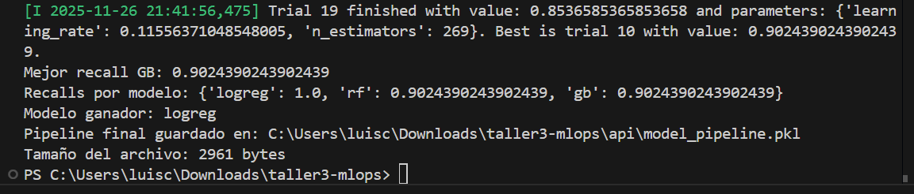
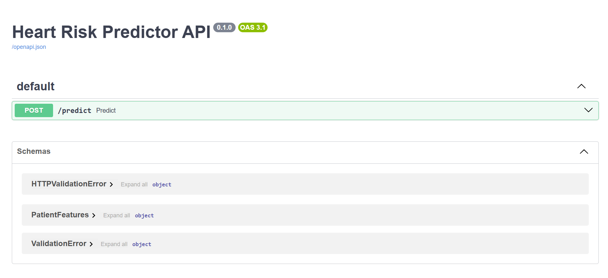

Predicción de Riesgo de Infarto – Proyecto MLOps (Taller 3)

Autores: 
Angélica Castro Londoño
Juan José Herrera
Luis Cano

# 1. Entendimiento del negocio

Los hospitales necesitan identificar pacientes de alto riesgo de infarto para priorizar recursos, hacer chequeos preventivos y reducir muertes evitables.

## Objetivo de negocio:
Predecir el riesgo cardiovascular y priorizar pacientes antes de que presenten un evento.

# 2. Entendimiento de los datos

Dataset elegido: Heart Attack Analysis & Prediction Dataset

Variables relevantes:
edad
sexo
colesteról
presión arterial
thalach
oldpeak
exang
slope
ca, thal

# 3. Preparación de datos

* Se dividió en train/test y se aplicó StandardScaler
* Se construyó un pipeline de preprocesamiento automático
* Todos los features son numéricos debido a la transformación estandarizada

# 4. Modelado

Se entrenaron 3 modelos (Hicimos un nivel elemental d eentrenamiento):
* LogisticRegression
* RandomForestClassifier
* GradientBoostingClassifier

# *El mejor modelo fue GradientBoostingClassifier, optimizado con Optuna.*

  Traiing del modelo

 swagger

 ml flow

 s3

 ec2

 Mosaico AWS

